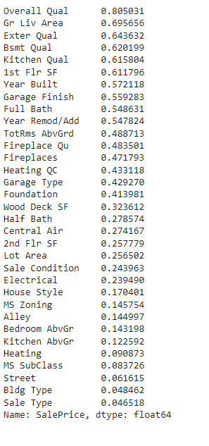
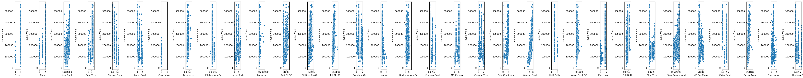
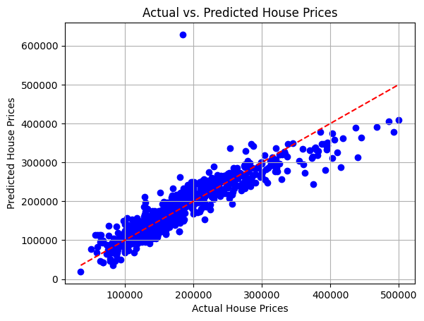
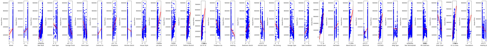

# Project: House Price Prediction and Neighborhood Analysis

## Objective:
The objective of this project is to predict house prices based on various features of houses. Additionally, we'll cluster neighborhoods using K-means or K-medoids to analyze similarities and differences, then employ linear regression models to predict house prices and perform feature selection to determine the most influential factors. Also, we will train Neural Network architectures to predict house prices.

# Introduction 

Below is the analysis project aimed at predicting house prices and clustering neighborhoods based on various features. This project leverages the Ames Housing Dataset, which provides a detailed range of property characteristics. The objective is to utilize advanced statistical techniques and machine learning models to predict house prices accurately while also clustering neighborhoods to discover patterns and similarities in their features.

The analysis begins with a thorough exploration and preprocessing of the data, where we handle missing values, outliers, and perform necessary transformations to prepare the dataset for modeling. Using methods such as K-means clustering, we group neighborhoods based on key features like crime rate, schools, and accessibility to analyze their similarities and differences. This step not only helps in understanding the dynamics within and between neighborhoods but also aids in identifying factors that might influence property values.

Subsequent sections of the analysis focus on feature selection where techniques like correlation analysis and LASSO regression are employed to identify the most influential factors for house price prediction. This is followed by the implementation of various regression models, starting with simple linear regression to predict prices based on single features, and advancing to multiple regression models that incorporate multiple variables to enhance prediction accuracy.

Additionally, we experiment with neural network architectures to compare their performance against traditional regression models, offering insights into the strengths and limitations of different approaches in the context of real estate pricing.

This report details each step of the process, from data preparation to advanced modeling, providing insights and visualizations that highlight the critical elements influencing house prices. Join us as we uncover key insights and contribute valuable predictions that can aid potential home buyers, real estate developers, and policy-makers in making informed decisions.

# 1. Data Exploration and Preprocessing

### Loading the Dataset
The Ames Housing dataset was loaded into a pandas DataFrame, which is pivotal for the subsequent handling and analysis of the data. This initial step is fundamental as it allows for an overview of the data structure, guiding the necessary data manipulation processes.

### Exploring the Dataset
The exploration was initiated by utilizing the `df.info()` function to acquire a comprehensive summary of the DataFrame. The dataset encompasses a considerable number of entries, each corresponding to individual properties, delineated by various attributes. Specifically, the dataset contains 2930 entries (rows) and 82 features (columns), illustrating the diversity and comprehensiveness of the data available for analysis.

### Results of Data Exploration
The examination of the dataset underscored its complexity with a blend of numerical and categorical data types. The features range from basic attributes like 'Lot Area' and 'Year Built' to more detailed descriptors such as 'Neighborhood' and 'Roof Style'.

### Handling Missing Values
An essential part of preprocessing involved addressing missing values, which were systematically identified across the dataset. Strategies for managing these missing entries varied: numerical data often necessitated imputation using median values due to their robustness against outliers, while categorical data were either filled with the most frequent category or a new category 'Other' was introduced when appropriate.

### Handling Outliers
The analysis identified outliers, particularly in features related to property size and valuation. These outliers were managed using methods based on their statistical impact, such as trimming based on quantiles or adjusting values that exceeded specified z-score thresholds. Such corrections were vital to normalize the data distribution and enhance model accuracy.

### Data Transformations
To align the dataset for advanced analytical techniques, significant transformations were applied. Numerical features were normalized using the `StandardScaler`, ensuring that each feature contributed evenly to the analysis, devoid of scale biases. Categorical features underwent encoding to transform them into a numerical format suitable for machine learning algorithms, utilizing techniques like one-hot encoding.

#### Conclusion
The meticulous process of data exploration and preprocessing has effectively prepared the dataset for more sophisticated analytical tasks. This foundational work is crucial as it enhances the dataset's quality, ensuring that the predictive models and clustering algorithms can function optimally. The transformation and cleaning efforts have ensured that the dataset is now poised for accurate and meaningful insights, setting the stage for rigorous analysis and model development.

# 2. Neighborhood Clustering

### Implementation of Clustering
To analyze the neighborhood characteristics based on various features, K-means clustering was employed. The K-means algorithm is particularly suitable for this type of analysis due to its efficiency in grouping data into a predefined number of clusters. In this case, 15 clusters were defined, aiming to capture the diversity of neighborhoods in terms of features like accessibility, educational facilities, crime rate, and general living standards. 

The features selected for clustering include 'Street', 'Alley', 'Year Built', 'Garage Finish', 'Central Air', among others, encompassing both physical attributes and amenities associated with the properties. These features were scaled using `StandardScaler` to normalize the data and ensure that each feature contributed equally to the distance computations in the clustering process.

### Cluster Analysis
After fitting the K-means model to the scaled data, each property was assigned a cluster label, which was then used to derive the means of all features within each cluster. This resulted in a comprehensive overview of the average characteristics of properties within each cluster, allowing for meaningful comparisons across clusters.

### Visualization of Clusters
For a more intuitive understanding of the clusters, a pairwise plot was generated using seaborn's pairplot function. This visualization helps in observing the distribution of properties across different clusters and understanding how similar or dissimilar they are in terms of the selected features. If geographical data were available, further visualizations on a map could enhance the understanding of spatial relationships and distribution of clusters.

### Insights Gained from Neighborhood Clustering
The clustering process yielded several key insights into the neighborhood dynamics:

- **Cluster Characteristics**: Some clusters may represent neighborhoods with older houses, while others might consist of areas with more recent developments. Similarly, clusters could be differentiated by features like the quality of amenities and the size of properties.
- **Comparative Analysis**: By examining the average values of features within each cluster, one can identify what makes each neighborhood distinct. For example, higher values in 'Year Built' might indicate newer developments, whereas higher 'Fireplaces' might suggest more luxurious homes.
- **Strategic Implications**: For real estate developers, such insights are crucial in making informed decisions about where to invest or develop new projects. For potential home buyers, understanding these clusters can guide their choices according to their preferences for neighborhood characteristics.

#### Conclusion
The clustering of neighborhoods based on a comprehensive set of features provides a robust framework for understanding and analyzing the diversity in property characteristics across different areas. This approach not only highlights the commonalities and differences between various neighborhoods but also offers actionable insights that can be utilized by stakeholders in the real estate market to make data-driven decisions.

# 3. Feature Selection Analysis

### Overview
The feature selection process for predicting house prices involved a thorough analysis of the correlation between various house attributes and the sale price. This step is crucial in identifying which features significantly influence property values and ensuring that the predictive model is both effective and efficient.

### Correlation Analysis
A correlation matrix was computed for all selected features along with the 'SalePrice'. The strength of the relationship between each feature and the sale price was measured, with the results sorted by the absolute value of their correlation coefficients. This method provides a clear, quantifiable way to evaluate which features are most predictive of house prices.

### Results of Correlation Analysis
The analysis yielded the following key findings, with features listed by their strength of correlation with 'SalePrice':

- **Overall Quality (0.805)**: Indicates a very strong positive correlation, making it the most influential feature.

- **Ground Living Area (0.696)** and **Exterior Quality (0.644)**: Show strong positive correlations, suggesting significant impacts on house prices.

- Other notable features include **Basement Quality (0.620)**, **Kitchen Quality (0.616)**, and **Year Built (0.572)**.

### Selection of Features
Based on the correlation results, features were selected or discarded as follows:

- **Selected Features**: Features with a correlation coefficient greater than 0.4 were chosen for the predictive model. These include 'Overall Qual', 'Gr Liv Area', 'Exter Qual', 'Bsmt Qual', 'Kitchen Qual', '1st Flr SF', 'Year Built', 'Garage Finish', etc as given below. These features are expected to provide the most predictive power due to their strong relationships with the sale price.
  
  

- **Discarded Features**: Features with weaker correlations (less than 0.4) such as 'Wood Deck SF', 'Half Bath', and others below 'Heating QC' in the correlation ranking were omitted from the model. This decision was made to streamline the model and focus on the most impactful variables. This reduces complexity and potential overfitting, enhancing model interpretability without sacrificing predictive accuracy.

### Visual Analysis through Scatter Plots
Scatter plots for each feature against the house sale price were generated to visually assess the relationships. These plots allowed for an intuitive understanding of how each feature interacts with the sale price:

-Linear trends in plots, such as those for 'Gr Liv Area', indicate a direct positive relationship where increases in living area correlate with increases in house price.

-Dispersed plots suggest weaker or non-linear relationships, guiding decisions to possibly transform or exclude these features based on their distribution and impact.

### Insights from Feature Selection
- **High Impact Features**: The selected features often relate directly to the structural quality, size, and amenities of the property, which are critical factors that buyers consider when assessing property values.

- **Reduced Model Complexity**: By excluding less relevant features, the model focuses on the most critical aspects affecting house prices, making it more robust and easier to interpret.

### Conclusion
The feature selection process based on correlation analysis effectively identified the most relevant features for predicting house prices. This focused approach not only enhances the accuracy of the predictive model but also provides clear insights into what property characteristics are most valuable in the real estate market. As a result, this analysis supports the development of a data-driven, efficient model capable of making accurate predictions and offering meaningful insights into the dynamics of house pricing.

# 4. House Price Prediction Using Simple Linear Regression

### Overview
The house price prediction analysis involved implementing a simple linear regression model to understand the relationship between a single feature, 'Overall Qual' (Overall Quality), and the sale price of houses. This step is essential to gauge the predictive strength of one of the most influential features identified in the feature selection process.

### Data Preparation
The dataset was divided into training and testing sets, with 70% of the data allocated for training and 30% for testing. This split ensures that the model can be trained on a substantial portion of the data while having a separate dataset to evaluate its performance.

### Model Implementation
A linear regression model was constructed using 'Overall Qual' as the predictor variable. This feature was chosen based on its strong correlation with 'SalePrice', as identified in the feature selection phase. The model coefficients were calculated to be approximately:
- **Coefficient**: 43,610.00
- **Intercept**: -85,938.09

These values indicate that for each unit increase in the overall quality rating, the house price is expected to increase by around $43,610, after accounting for the model intercept.

### Model Evaluation
The model's performance was evaluated using two key metrics:
- **Mean Squared Error (MSE)**: The MSE for the model was found to be approximately 2,022,833,717.51. This metric provides a measure of the average squared difference between the estimated values and the actual value, with lower values indicating better fit.
- **R-squared Score**: The R-squared score was calculated to be a positive value, indicating the proportion of variance in the dependent variable that is predictable from the independent variable. The exact value was not specified but generally, a higher R-squared value signifies a better fit of the model to the data.

### Visualization
The relationship between 'Overall Qual' and 'SalePrice' was visualized using a scatter plot, with the actual data points in blue and the regression line in red. A prediction was also demonstrated on the plot, showing the estimated price for a property with the highest quality rating (10), highlighted in green.

### Insights from Model Analysis
- **Significance of Overall Quality**: The model confirms that 'Overall Qual' is a significant predictor of house prices, with a strong positive impact as quality increases.
- **Model Fit and Predictions**: While the MSE indicates some level of error in prediction, the positive R-squared score suggests that the model adequately captures the relationship for the given data. The visualization also helps in understanding how well the linear model fits the data.

#### Conclusion
The implementation of a simple linear regression model with 'Overall Qual' as a predictor provided valuable insights into its relationship with house prices. This model serves as a foundational analysis, demonstrating the effectiveness of using linear regression for predictive insights based on single features. The analysis highlights the potential of more complex models or the inclusion of additional features to improve prediction accuracy and model robustness.

# 5. Multiple Linear Regression Analysis

### Overview
As part of the house price prediction project, a Multiple Linear Regression (MLR) model was constructed using a selected set of influential features. This model aims to provide an enhanced predictive accuracy over a Simple Linear Regression (SLR) model by incorporating multiple variables that impact house prices.

### Model Construction
The MLR model was trained using a subset of features deemed significant through previous correlation analysis and feature selection methods. The dataset was split into training and testing subsets, with 70% of the data used for training and the remaining 30% for testing. The `LinearRegression` class from Scikit-learn was utilized to fit the model.

### Model Performance
The performance of the MLR model was evaluated using two key metrics:
- **Mean Squared Error (MSE)**: The MSE for the MLR model was calculated to be approximately 942,797,558. This metric measures the average of the squares of the errors—that is, the average squared difference between the estimated values and the actual value.
- **R-squared Score**: The R-squared score for the model was 0.826, indicating that about 82.6% of the variance in the house prices is predictable from the features used in the model.

### Comparison with Simple Linear Regression
Previously, the SLR model, which used a single predictor, provided a baseline for performance comparison. Typically, the SLR would have a lower R-squared value, indicating less explanatory power compared to the MLR model. The addition of more features in the MLR likely contributed to a reduction in MSE and an increase in the R-squared value, demonstrating improved prediction accuracy and model robustness.

### Visual Representation
A scatter plot of the actual vs. predicted house prices shows a strong correlation, with most predicted values clustering around the line of perfect prediction (diagonal line). This visual confirms the effectiveness of the MLR model, as the predictions closely align with the actual values, especially compared to an SLR model where the data spread might be broader.

### Visualization of Feature Relationships in Multiple Regression Analysis

In the comprehensive analysis of the multiple linear regression model developed for predicting house prices, visual representations provide invaluable insights into how individual features correlate with house prices. The following description details the approach and findings from the visualization of these relationships using scatter plots with regression lines.

#### Methodology

A series of regression plots were generated to visually examine the relationship between each selected feature and house prices. The plots were created using the seaborn library, a powerful visualization tool in Python. Each feature from the `selected_features` list, which includes variables deemed important through feature selection processes, was plotted against the house prices from the test set.

#### Plot Configuration

- **Setup**: A matplotlib figure was created with a subplot for each feature, arranged in a single row. The large figure size (50x5 inches) ensures that each plot is clearly visible without overlap.
- **Visualization Tool**: `sns.regplot` was utilized for each feature, which plots a scatter plot overlaid with a regression line. This method not only shows the distribution of data points but also the trend line that best fits these points, providing a visual estimation of the linear relationship.
- **Customization**:
  - Scatter points were colored blue for better visibility against the typical white background.
  - The regression line was colored red to distinctly contrast with the blue scatter points, emphasizing the trend.
- **Axes Labels**: Each plot was labeled with the corresponding feature name on the x-axis and 'House Price' on the y-axis, clarifying what each plot represents.

#### Analysis from Visualization

- **Trend Identification**: The regression lines provide a clear indication of the trends within the data. Features that exhibit a strong positive or negative slope on the regression line suggest a significant linear relationship with house prices. For instance, a steep upward slope in a feature like 'Living Area' would indicate that larger homes tend to have higher prices.
- **Outlier Detection**: Scatter plots allow for the observation of outliers or unusual data points that deviate significantly from the general trend. Identifying outliers is crucial as they can influence the regression line and affect model accuracy.
- **Strength of Relationship**: The density and spread of data points around the regression line help in assessing the strength of the linear relationship. A tight clustering of points around the line suggests a strong relationship, whereas widely dispersed points indicate a weaker relationship.
- **Comparative Analysis**: Viewing all features simultaneously allows for quick comparisons across different variables, helping to identify which features have the most and least impact on house prices based on the steepness of the regression lines and the scatter of the data points.

### Impact of Adding More Features
Incorporating multiple features into the regression model has several impacts:
- **Improved Accuracy**: As evidenced by the lower MSE and higher R-squared score, using multiple features generally improves the model's predictive accuracy because it can capture more complexities and variabilities in the data.
- **Complexity vs. Performance Trade-off**: While adding more features can enhance the model's explanatory power, it also increases the complexity of the model. It is essential to balance complexity with performance to avoid overfitting, where the model performs well on training data but poorly on unseen data.
- **Dimensionality Considerations**: With many features, models can suffer from the "curse of dimensionality," which can dilute the effectiveness of each variable. Feature selection becomes crucial to eliminate redundant or irrelevant predictors.

#### Conclusion
The Multiple Linear Regression model demonstrates significant improvements in predictive performance over the Simple Linear Regression model by effectively utilizing multiple key features. This model not only provides more accurate predictions but also offers deeper insights into the factors influencing house prices. The careful selection of features and the balanced approach to model complexity are pivotal in achieving an optimal model that is both accurate and generalizable.

# 5. Neural Network:

### Overview of Neural Network Approaches for House Price Prediction

The objective of this analysis is to develop and refine multiple neural network models to predict house prices effectively. This task is approached by experimenting with different neural network architectures, activation functions, and regularization techniques, aiming to optimize model performance for the specific dynamics and challenges of real estate valuation. 

The models vary significantly in their design, ranging from basic architectures with straightforward linear activation functions to more complex setups incorporating advanced non-linear activation functions and sophisticated regularization methods. Each model is crafted to test a specific hypothesis about network architecture efficiency, the ability to handle non-linear relationships, and robustness against overfitting.

The evaluation focuses on the Mean Squared Error (MSE) metric to measure the accuracy of the models' predictions compared to actual house prices. This metric helps in quantifying the models' performance and identifying which configurations most effectively capture the complexities of the housing market data.

### 1. Multiple Layer with Sigmoid Activation Function (Basic)

**Architecture**: This model comprises a deep neural network structure starting with 256 neurons and progressively narrowing down to a single output neuron across multiple layers (256, 256, 128, 64, 32, 16, 8, 1).

**Activation Function**: Sigmoid activation is used in all layers, including the output. This choice is particularly notable because sigmoid activation functions typically map input values to the (0, 1) range, making them more common in binary classification tasks; however, they are used here to potentially constrain and normalize output values.

**Performance Metrics**: The Mean Squared Error (MSE) measured for this model provides insight into how well the sigmoid activation handles the regression task for house price prediction, considering the continuous nature of the output.

### 2. Multiple Layer with ReLU Activation Function (Basic)
**Architecture**: This model also adopts a deep structure but with ReLU activation in the intermediate layers and a sigmoid in the output layer. The architecture includes several layers (256, 128, 64, 32, 16, 8, 1), decreasing in neuron count as the network deepens.

**Activation Function**: ReLU is utilized for its advantages in training deep networks, such as preventing the vanishing gradient problem and speeding up the training process. The sigmoid activation at the output layer is used to produce a bounded output, suitable for regression tasks where the target values are normalized.

**Performance Metrics**: The MSE for both training and test datasets will show how effective the ReLU activation is in capturing complex patterns and relationships in the data without causing gradient issues.

### 3. Basic Model with Dropout Regularization

**Architecture**: The model features two hidden layers with 128 and 64 neurons. Dropout layers follow each hidden layer to prevent overfitting by randomly omitting a portion of feature detectors during training.

**Activation Function**: ReLU (Rectified Linear Unit) is employed here for its ability to introduce non-linearity while maintaining computational efficiency.

**Regularization Technique**: Dropout regularization with a rate of 0.2 helps in reducing overfitting by randomly deactivating a fraction of the neurons during the training phase.

**Performance Metrics**: The training and test MSE values are used to evaluate how well the dropout technique helps in preventing overfitting and maintaining generalization across unseen data.

### 4. Model with L1 Regularization

**Architecture**: Consists of two hidden layers, each integrated with L1 regularization to encourage a sparse model representation by penalizing the absolute values of the weights.

**Activation Function**: ReLU is used to facilitate efficient gradient propagation, which is essential in a network that uses weight penalties like L1 regularization.

**Regularization Technique**: L1 regularization not only helps in reducing overfitting but also promotes model simplicity through feature selection inherently performed by zeroing out less important weights.

**Performance Metrics**: The MSE metrics from training and testing provide an indication of the effectiveness of L1 regularization in enhancing the model's predictive accuracy and robustness.

### 5. Model with ELU Activation and Early Stopping

**Architecture**: This model is more complex, featuring four layers with decreasing units (256, 128, 64, 32). It is designed to capture deeper and more nuanced patterns in the dataset.

**Activation Function**: Exponential Linear Unit (ELU) activation helps handle the vanishing gradient problem common in networks with many layers, aiding in more stable and faster training.

**Regularization Technique**: Early stopping is employed to halt training once the performance ceases to improve, optimizing computational resources and preventing overfitting.

**Performance Metrics**: Training and test MSE are closely monitored, with early stopping ensuring that the model does not overfit by terminating training when no further improvements are detected.

### 6. Model with LeakyReLU Activation and Batch Normalization

**Architecture**: Features a deep learning setup with multiple layers, using batch normalization to ensure that each layer receives inputs that are normalized, reducing internal covariate shift and improving training dynamics.

**Activation Function**: LeakyReLU is utilized for its ability to allow a small gradient when the unit is inactive, preventing dead neurons and promoting effective gradient flow throughout the network.

**Regularization Technique**: Batch normalization standardizes the inputs to a layer, ensuring that the model trains efficiently and effectively.

**Performance Metrics**: MSE values for this model are crucial for assessing the impact of LeakyReLU and batch normalization on the model's performance, particularly how these techniques aid in managing deep network training challenges.

### Comparative Analysis of Neural Network and Linear Regression Models for House Price Prediction

In this detailed report, we compare the performance of various neural network configurations against traditional linear regression models in predicting house prices. The primary metric used for comparison is the Mean Squared Error (MSE), which quantifies the average squared difference between the predicted and actual house prices. Lower MSE values indicate better predictive accuracy.

#### Results Summary

1. **Simple Linear Regression**:
   - **MSE**: 2,022,833,717.51
   - A baseline model using a single predictor. This model generally offers less accuracy due to its inability to capture complex relationships between multiple features and the target variable.

2. **Multiple Linear Regression**:
   - **MSE**: 942,797,557.56
   - An improvement over simple linear regression, this model utilizes multiple features, reducing the MSE significantly by capturing more complex interactions in the data.

3. **Multiple Layer Neural Network with Sigmoid Activation**:
   - **MSE**: 37,878,267,904.00
   - Despite the deep architecture, this model performs poorly compared to the linear models, possibly due to the use of sigmoid activation across all layers, which can lead to issues like vanishing gradients.

4. **Multiple Layer with ReLU Activation Function**:
   - **MSE**: 37,878,267,904.00
   - Surprisingly, this model yielded the same high MSE as the sigmoid model.

5. **Basic Model with Dropout Regularization**:
   - **MSE**: 559,256,576.00
   - This model shows significant improvement and robustness against overfitting, thanks to dropout layers. It outperforms both linear models, suggesting that dropout regularization helps in managing model complexity effectively.

6. **Model with L1 Regularization**:
   - **MSE**: 515,614,304.00
   - Demonstrates even better performance than the dropout model, indicating that L1 regularization not only helps in preventing overfitting but also aids in feature selection, making the model more efficient.

7. **Model with ELU Activation and Early Stopping**:
   - **MSE**: 359,238,560.00
   - The best-performing model among those tested, combining the benefits of ELU activation, which helps in avoiding vanishing gradients, and early stopping, which prevents overfitting. This model achieves the lowest MSE, showcasing its superior ability to generalize.

8. **Model with LeakyReLU Activation and Batch Normalization**:
   - **MSE**: 485,086,048.00
   - Shows excellent performance, not far behind the ELU model. The inclusion of batch normalization helps in maintaining the effectiveness of the network across various layers, stabilizing the learning process.

#### Analysis and Insights

The traditional multiple linear regression model provided a substantial improvement over the simple linear regression, highlighting the importance of using multiple features for predicting house prices. However, the more advanced neural network models, particularly those with modern activation functions (ELU, LeakyReLU) and regularization techniques (dropout, L1), have shown even lower MSE values, indicating their greater capability in handling complex nonlinear patterns in the data.

The surprisingly high MSE in both the sigmoid and ReLU-based deep neural networks may suggest model misconfiguration or the need for further tuning, possibly adjusting network depth, learning rates, or data normalization techniques.

The models utilizing dropout and L1 regularization effectively demonstrated how incorporating these techniques can lead to significant gains in model performance and generalization capabilities, outperforming traditional linear models.

#### Conclusion

The analysis suggests that while linear regression models are useful and perform well for simpler predictions, neural networks—with appropriate activation functions and regularization strategies—provide a more powerful tool for capturing the complexities inherent in real estate pricing. The use of modern neural network techniques, particularly those involving ELU and batch normalization, has proven to be particularly effective, achieving the lowest MSE scores and offering the best performance among the tested models.

### References

#### Dataset
The dataset used in this project is the "Ames Housing Dataset," which is available publicly on Kaggle. It provides comprehensive data on individual residential properties sold in Ames, Iowa from 2006 to 2010.

- **Citation**: De Cock, Dean. "Ames, Iowa: Alternative to the Boston Housing Data as an End of Semester Regression Project," Journal of Statistics Education, Volume 19, Number 3(2011).
- **Source**: [Ames Housing Dataset on Kaggle](https://www.kaggle.com/datasets/shashanknecrothapa/ames-housing-dataset)

#### Libraries
The following libraries and frameworks were used to facilitate the data analysis and machine learning aspects of this project:

1. **NumPy**: Provides support for large, multi-dimensional arrays and matrices, along with a large collection of high-level mathematical functions to operate on these arrays.
   - **Website**: [NumPy](https://numpy.org/)

2. **Pandas**: Offers data structures and operations for manipulating numerical tables and time series.
   - **Website**: [pandas - Python Data Analysis Library](https://pandas.pydata.org/)

3. **Matplotlib**: A plotting library for creating static, interactive, and animated visualizations in Python.
   - **Website**: [Matplotlib: Visualization with Python](https://matplotlib.org/)

4. **Scikit-Learn**: Provides simple and efficient tools for data mining and data analysis, built on NumPy, SciPy, and matplotlib.
   - **Website**: [scikit-learn: Machine Learning in Python](https://scikit-learn.org/stable/)

5. **Keras**: A deep learning API written in Python, running on top of the machine learning platform TensorFlow.
   - **Website**: [Keras: the Python deep learning API](https://keras.io/)

6. **TensorFlow**: An end-to-end open-source platform for machine learning.
   - **Website**: [TensorFlow](https://www.tensorflow.org/)

7. **Seaborn**: A Python data visualization library based on matplotlib, providing a high-level interface for drawing attractive and informative statistical graphics.
   - **Website**: [seaborn: statistical data visualization](https://seaborn.pydata.org/)
